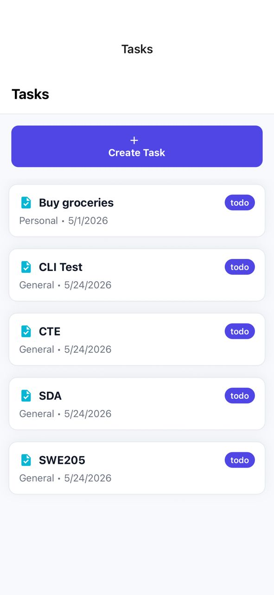
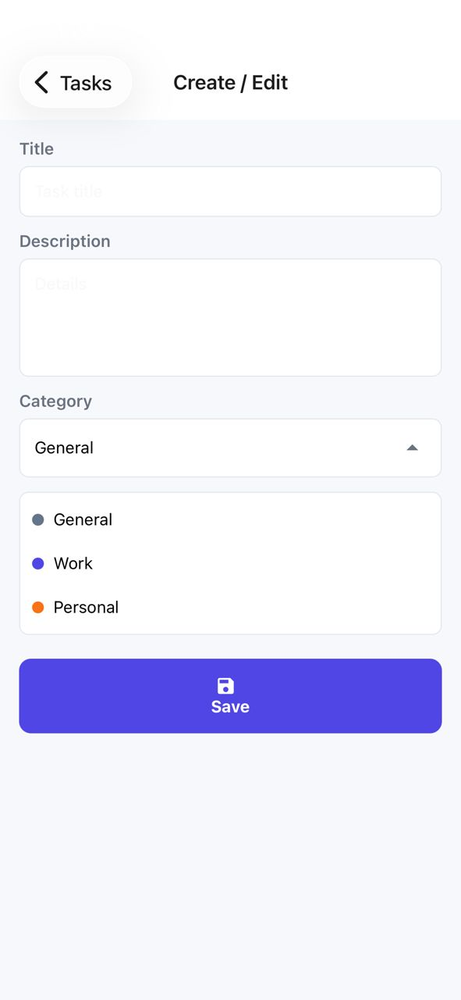
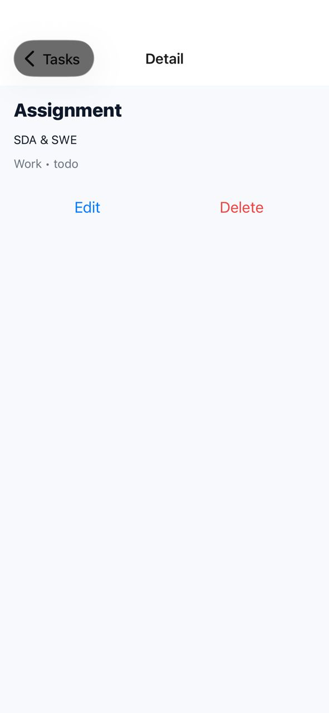
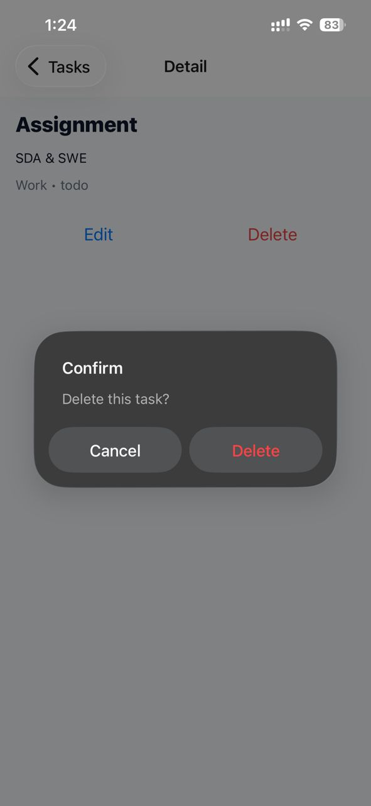

# Task Manager (Assignment 3)

An Overview
-----------------
A single-domain Task Manager mobile app built with Expo + React Native (TypeScript). It demonstrates CRUD operations for tasks backed by a local json-server REST API, global state with Context + useReducer persisted to AsyncStorage, a custom hook for API interactions, and a polished UI with icons and simple animations.

Domain & main entities
----------------------
- Task
  - `id: number`
  - `title: string` (required)
  - `description?: string`
  - `category: string` (category name)
  - `status: 'todo'|'inprogress'|'done'`
  - `createdAt: string` (ISO timestamp)

- Category
  - `id: number`
  - `name: string`
  - `color?: string` (hex color for badge)

State management
----------------
The app uses React Context + `useReducer` for global state (tasks list) and persists state to `AsyncStorage`. Rationale:
- Small app: Context + reducer is lightweight and simple to reason about.
- Persistence with `AsyncStorage` makes the app usable offline and retains user data between runs.

Backend
-------
- Technology: `json-server` (simple mock REST API) driven from `backend/db.json` and `backend/server.js`.
- Main endpoints provided by json-server (base URL: `http://<dev-host>:3001`):
  - `GET /tasks` — list tasks
  - `GET /tasks/:id` — get a single task
  - `POST /tasks` — create a task
  - `PUT /tasks/:id` — update a task
  - `DELETE /tasks/:id` — delete a task
  - `GET /categories` — list categories
  - `POST /categories` — create category

How the client finds the backend
--------------------------------
`src/api/api.ts` resolves the developer host IP from the Expo manifest (via `expo-constants`) so a physical device running Expo Go can reach your dev machine. If your device and dev machine are on the same Wi-Fi, the app will compute `http://<your-pc-ip>:3001` automatically. If needed, you can override using the `API_BASE_URL` environment variable.

Setup & run (developer)
------------------------
Prerequisites:
- Node.js (16+ recommended)
- npm or yarn
- Expo CLI (optional) and Expo Go on device

Install dependencies (app):
```bash
cd Assignments/Assignment3
npm install
# ensure Expo packages are installed
npx expo install
```

Install backend deps and start json-server (in separate terminal):
```bash
cd Assignments/Assignment3/backend
npm install
node server.js
# JSON Server listens on http://localhost:3001 by default
```

Start the Expo app (from app folder):
```bash
cd Assignments/Assignment3
npx expo start -c
```
Open the project in Expo Go on a physical device (same Wi-Fi) or in an emulator.

Notes on connection problems:
- If the device shows network errors when saving, ensure the backend is running and that the device can reach your PC (same Wi-Fi).
- You can change the backend port or set `API_BASE_URL` before starting the app to a fully-qualified URL (e.g. `http://192.168.1.100:3001`).


# Task Manager (Assignment 3)

This is a small, focused Task Manager app I built for Assignment 3.

Think of it as a neat little demo of a single-purpose mobile app: create tasks, give them a category, mark status, and come back later — everything is stored locally on your device and backed by a tiny mock server for easy testing.

What the app models
-------------------
At its heart the app manages two simple concepts:

- Task — a short note about something you need to do. Each task has a title, optional description, a category name, a status (todo/inprogress/done), and a created timestamp.
- Category — a small label you use to group tasks (like "Work", "Personal") and an optional color for a visual badge.

Why it’s built this way
----------------------
I chose a minimal architecture so the assignment focuses on core app concerns rather than infrastructure:

- State: React Context + `useReducer` keeps global state logic explicit and easy to test. `AsyncStorage` persists tasks so your list survives app restarts.
- API: a `json-server` backend provides a realistic REST surface without the overhead of a production server.
- UX: icons, cards, and small layout animations make the app feel smoother while keeping implementation approachable.

Quick description
----------
- List view: shows your tasks with category and status badges.
- Form view: create or edit a task; pick a category from a dropdown.
- Detail view: see task details, edit, or delete.

Developer notes (for running)
----------------------------
The app lives under `Assignments/Assignment3`. There’s a tiny `backend/` folder that runs `json-server` using `db.json` so you can test the full CRUD flow locally. If you want to run it:

1. Start the backend in its folder: `node backend/server.js` (it listens on port 3001).
2. Start the app with Expo from the app folder: `npx expo start -c`.

The app automatically detects your development machine’s IP via Expo’s manifest so a physical device on the same Wi‑Fi can reach the backend.

What’s included
----------------------------
- `App.tsx` — app entry and provider wiring
- `src/screens/*` — list, form, and detail screens
- `src/hooks/useTasks.tsx` — the custom hook that talks to the backend and dispatches state updates
- `src/store/TaskContext.tsx` — reducer and AsyncStorage persistence
- `src/api/api.ts` — axios instance and helper functions
- `backend/server.js`, `backend/db.json` — mock REST API

Known rough edges
-----------------
- No authentication — the app is single-user and demo-oriented.
- Category creation from the UI is basic; you can extend it with a small modal if you want a richer experience.
- Error handling is intentionally simple (alerts + console logs) — suitable for a student project.

Screenshots
-----------
I added example screenshots to `assets/screenshots/`. Below are the images as they appear in the app:

- List view (tasks list)



- Form view (create / edit)



- Detail view (task details)



- Delete action (confirmation)




